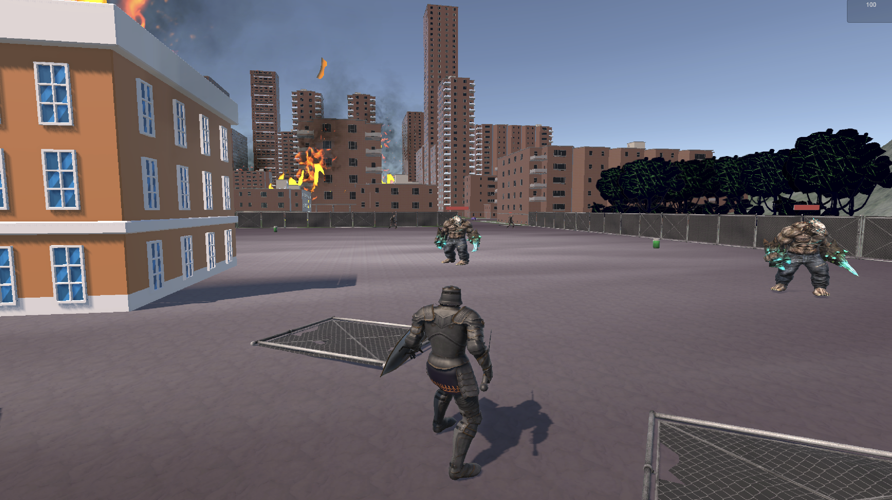
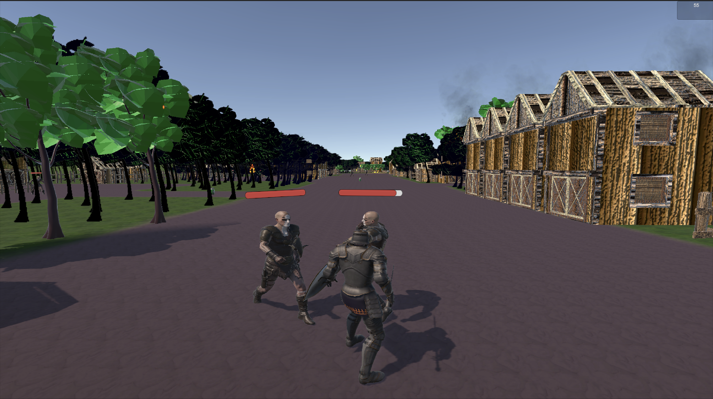
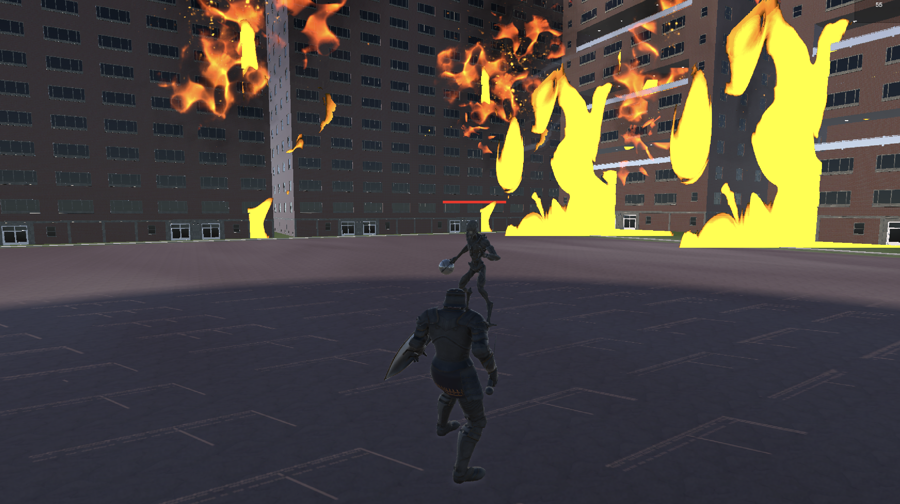

# steel-clash: A 3D Action Adventure Game

**steel-clash** is a third-person action-adventure game built in **Unity**. It features a third-person melee fighter who must navigate through three unique levels filled with increasingly dangerous enemies. Players must combine strategic blocking, swift attacks, and timely dodges to survive. Along the way, they can collect power-ups, including health packs and temporary damage boosts, to gain an edge in combat. Each level concludes with tougher enemies, culminating in an intense boss battle.

  
  
  
  

---

## Core Gameplay Features:

- **Punching and Kicking:** Quick melee options for close combat encounters.
- **Sword Combat:** High-damage, long-range melee using a sword.
- **Shield Blocking:** Significantly reduces damage from melee and completely nullifies ranged attacks.
- **Dodging:** Enables quick evasive movement using the dodge key.
- **Exploding Enemies:** Certain enemies will detonate near the player after a short delay.
- **Health & Attack Power-ups:** Pickups scattered across levels or dropped by defeated enemies.
- **Boss Fight:** A cinematic and challenging final battle to conclude the game.

---

## Player Controls

| Action       | Key / Input       |
| ------------ | ----------------- |
| Move         | WASD / Arrow Keys |
| Run          | Left Shift        |
| Jump         | Spacebar          |
| Light Attack | Left Click        |
| Kick         | `K` key           |
| Block        | Hold Left Alt     |
| Dodge        | `Q` key _(TBD)_   |

---

## Enemies

Each enemy uses custom AI with detection, pathfinding, and attack logic.

| Enemy           | Type    | Behavior Summary                                 |
| --------------- | ------- | ------------------------------------------------ |
| Wobbly Steve    | Melee   | Chases and punches; 5 HP damage                  |
| Sir Stabs-a-Lot | Melee   | Sword strikes; 10 HP damage; drops +15 HP        |
| Archer McStabby | Ranged  | Stationary archer; arrows deal 5 HP; drops boost |
| Exploder        | Suicide | Detonates in range; 20 HP damage                 |
| The Boss        | Mixed   | Randomized punch/pound attacks; triggers win     |

---

## Systems Implemented

### Combat & AI

- Cooldowns prevent attack spamming
- Blocking reduces or nullifies incoming damage
- Enemies detect players using field-of-view and sight radius
- Boss has a cinematic spawn and AI behavior

### Health & Power-Ups

- **Health Packs:** +5 HP from pickups, +15 HP from enemy drops
- **Attack Boost:** 2× damage for 60s (from Archer kill)

### Game State

- Player death triggers game over screen
- Boss death triggers victory screen
- Uses Unity UI and `GameManager.cs` for state control

### Animation

- Animator Controllers used for player and enemies
- States include movement, attacks, blocking, and death
- Transitions controlled by game events and input triggers

---

## Project Structure Highlights

- `PlayerController.cs` / `PlayerStatus.cs`: Input, combat, health
- `AIController.cs` / `AIStatus.cs`: Enemy behavior and health
- `EnemyAttack` subclasses: Punch, Sword, Arrow, Exploder, Boss
- `GameManager.cs`: Manages UI and win/loss conditions

---

## Notes

This README is a high-level overview. For deeper technical insights:

- See [`player_logic.md`](./docs/player_logic.md)
- See [`enemy_logic.md`](./docs/enemy_logic.md)
- See [`animation_controller.md`](./docs/animation_controller.md)
- See [`powerups_and_items.md`](./docs/powerups_and_items.md)
- See [`game_flow.md`](./docs/game_flow.md)

---
