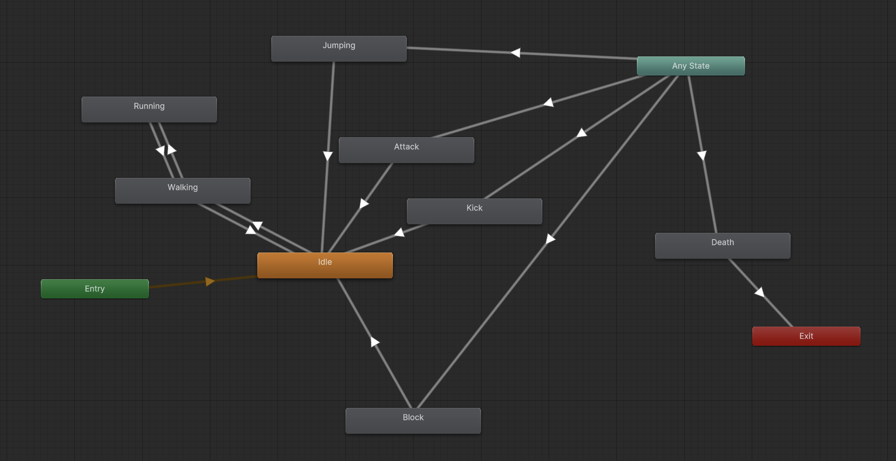
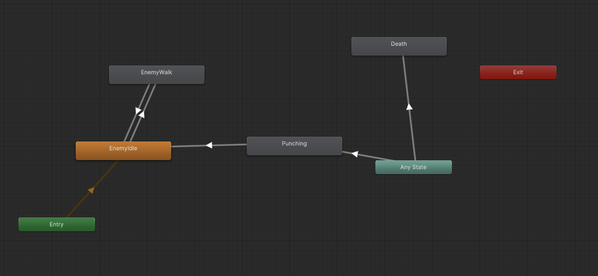

# Animation Controller Map

This document outlines the animation states, transitions, and parameters used in the Animator Controllers for both the player and enemy characters in **steel-clash**. Animations are controlled through a combination of triggers, booleans, and direct state play calls from C# scripts.

---

## Player Animator

### States:

- `Idle`: Default resting animation.
- `Walking`: When movement input is detected.
- `Running`: When movement + run key (`Shift`) is pressed.
- `Jumping`: Triggered when jumping.
- `Attack`: Light attack (punch/sword), triggered via left-click.
- `Kick`: Separate animation triggered via `K` key.
- `Block`: Entered when holding `Left Alt`.
- `Death`: Triggered when HP reaches 0.

### Parameters:

| Name         | Type    | Used For                         |
| ------------ | ------- | -------------------------------- |
| `isWalking`  | Boolean | Enables walking blend tree       |
| `isRunning`  | Boolean | Enables faster movement state    |
| `isBlocking` | Boolean | Activates shield/block animation |
| `isDead`     | Boolean | Triggers death state             |
| `Attack`     | Trigger | Plays light attack animation     |
| `Kick`       | Trigger | Plays kick attack animation      |

### Transitions:

- `Any State → Death`: Triggered via `isDead == true`
- `Any State → Block`: While `isBlocking == true`
- `Idle/Walk/Run → Attack/Kick`: Based on trigger
- `Walk ↔ Run`: Controlled by `isRunning`
   

---

## Enemy Animator (Wobbly Steve, Sir Stabs-a-Lot, etc.)

### States:

- `EnemyIdle`: Default resting state.
- `EnemyWalk`: Movement using `NavMeshAgent`
- `Punching` / `Striking`: Attack animations
- `Death`: Plays when enemy dies

### Parameters:

| Name        | Type    | Used For                     |
| ----------- | ------- | ---------------------------- |
| `isWalking` | Boolean | Enables walking animation    |
| `Attack`    | Trigger | Plays enemy attack animation |
| `isDead`    | Boolean | Plays death animation        |

### Transitions:

- `Idle ↔ Walk`: Based on `isWalking` toggle
- `Any State → Death`: Triggered via `isDead == true`
- `Idle/Walk → Attack`: Triggered via `Attack`
   

---

## Boss Animator (Custom Logic)

### States:

- `Demon_Come-out1`: Spawn entrance animation
- `Demon|Punch2`: Regular punch attack
- `Demon|Punch3`: Pound attack (heavy damage)
- `Demon|Death`: Final death animation

### Controlled via Script:

- Animation clips are manually played using `animator.Play()`
- Boolean triggers like `isAttack`, `isPound`, `isDead` used for control

### Notes:

- Boss controller synchronizes animation timings using `yield return new WaitForSeconds(...)`
- Transitions occur based on player proximity, and attack range
